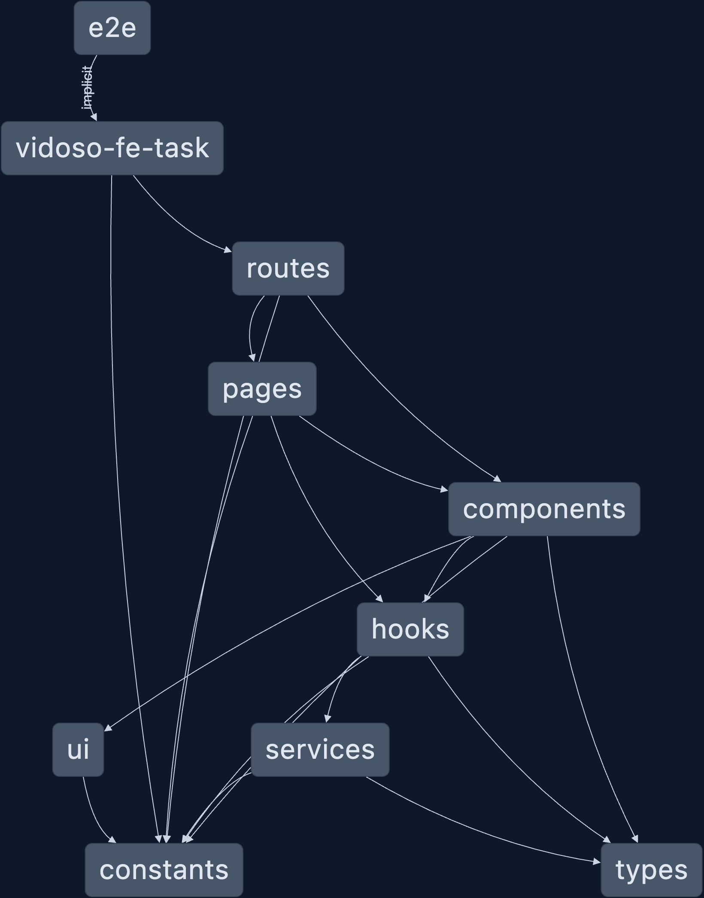

# VidosoFeTask

## Description

#### Task

[Coding Challenge Front-End Developer \_ Vidoso.pdf](task/Coding%20Challenge%20Front-End%20Developer%20_%20Vidoso.pdf)

## Demo

[https://vidoso-fe-task.vercel.app](https://vidoso-fe-task.vercel.app)

## Installation

- Clone the repository
- Run `npm install`
- Run `npm start`
- Open [http://localhost:4200](http://localhost:4200) to view it in the browser.
- Run `npm run build` to build the project
- Run `npm run preview` to serve the production build
- - Open [http://localhost:4300](http://localhost:4300) to view production preview in the browser.
- Run `npm test` to run tests
- Run `npm run e2e` to run end-to-end tests
- Run `npm run lint` to lint the project
- Run `npm run format` to format the project

## Technologies

- React
- TypeScript
- Axios
- React Router
- React Query
- Tailwind CSS
- React Testing Library
- Vitest
- Playwright
- Vite
- Eslint
- Prettier

## Structure

#### Graph diagram

## Final Thoughts

- Overall, I enjoyed working on this simple task. I achieved the main requirements and added some extra features, for
  performance and user experience.
- I could have used an ui state management library like Redux or Zustand, but this simple task I decided to use React Query to handle the
  API requests and the cache to manage server sate only.
- I Decided to not use much time on the design, as it was not the main focus of the task, several improvements can be
  made in this area.
- I used React Query to handle the API requests, it is a great library that makes it easy to handle the cache and the
  requests.
- Used debounce to avoid making requests on every keystroke.
- Implemented a simple pagination system.
- Only had around 4 hours to work on this task, so I had to make some decisions to deliver it on time.
- Unit tests and integration tests could be improved, I only added a few tests, with more time I would add more tests to
  cover all the main features.
- Normally I would use a TDD approach, but due to the time constraints, I decided to write the tests after the
  implementation.
- End-to-end tests are set up, but no tests were written, I would write tests for the main features if I had more time.
